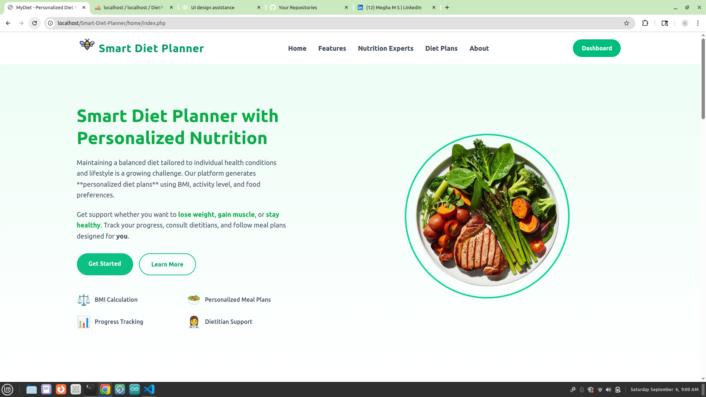

---

# 🥗 Smart Diet Planner

The **Smart Diet Planner** is a nutrition and fitness management web application that provides **personalized diet plans, BMI tracking, nutritionist approval, and progress visualization**.

It replicates a dietitian’s decision-making process using a **rule-based AI logic system**, while giving users tools to **track their health, book nutritionist appointments, and follow structured diet plans**.

---
## 🖼️ Homepage Preview

---

## 🌐 Local URLs

* User Home: [http://localhost/Smart-Diet-Planner/home/index.php](http://localhost/Smart-Diet-Planner/home/index.php)
* Nutritionist Portal: [http://localhost/Smart-Diet-Planner/nutrionist/index.php](http://localhost/Smart-Diet-Planner/nutrionist/index.php)
* Admin Login: [http://localhost/Smart-Diet-Planner/admin/login.php](http://localhost/Smart-Diet-Planner/admin/login.php)
* Admin Login: [http://localhost/phpmyadmin/](http://localhost/phpmyadmin/)

---

## 🚀 Key Features

### 👤 User Features

* **User Registration & Login** with secure authentication.
* Multi-step registration form:

  * Name, Age, Weight, Height, Email, Password, Food Preference, Plans.
* **User Dashboard**:

  * View & update profile (via Bootstrap modal).
  * Track BMI & diet plans.
* **Personalized Diet Plans** based on:

  * BMI, Age, Gender.
  * Activity Level.
  * Food Preference (Veg/Non-Veg/Vegan).
  * Fitness Goals (Weight Loss, Weight Gain, Muscle Gain, Balanced).
* **Progress Tracking**:

  * BMI history & comparison.
  * Weight tracking with charts.
  * Daily/Weekly/Monthly reports.

---

### 📊 Diet & Nutrition Management

* **Diet Plans Database** managed by admin:

  * Goal, Dietary Preference, Activity Level, Meal Type.
  * Plan description with macros (Protein, Carbs, Fat).
* Users get **AI-driven, rule-based diet suggestions**.
* **Charts & Visualizations** (calorie & nutrient breakdown).
* **Meal Cards** for structured, easy-to-follow diets.

---

### 👩‍⚕️ Nutritionist Management

* **Nutritionist Registration** with profile details (Name, Email, Phone, Specialization, Experience, Image).
* **Admin Approval System**:

  * Approve or reject nutritionist applications.
  * View approved nutritionists list.
  * Delete nutritionists if needed.
* **Appointment Booking**:

  * Users can view nutritionists.
  * Book appointments through the contact page.

---

### 📅 Pages

* **Home Page** – Modern responsive UI (TailwindCSS).
* **Diet Plan Page** – Explains diet strategies (Calorie Deficit, Balanced, High-Protein, etc.).
* **Personalized Diet Plan Page** – User-specific meal recommendations.
* **Contact Page** – Nutritionist details & appointment form.
* **Admin Dashboard** – Manage:

  * Nutritionists (Approval, Deletion).
  * Diet Plans (Create, Update, Delete).

---

### 🛠️ Technical Stack

* **Frontend**: TailwindCSS (modern responsive UI).
* **Backend**: PHP (session-based authentication).
* **Database**: MySQL.
* **Charts**: Chart.js (for calories, macros, BMI tracking).
* **Version Control**: Git & GitHub.

---

## 🔑 Admin Credentials (Demo)

* **Email**: `admin@example.com`
* **Password**: `admin123`

---

## 👨‍💻 Contributor

**Developer:** Megha M S (CHN24MCA-2036)
📌 Developed as part of **MCA Final Year Project**

---

## 📜 License

This project is developed strictly for educational purposes as part of the MCA program.
It is not intended for commercial use. You may study, modify, and use the code only for learning and academic projects.

---
